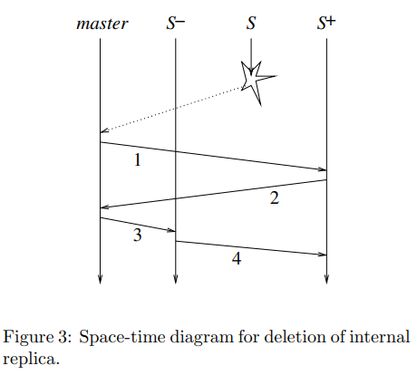

# Chain Replication论文阅读笔记

&emsp;&emsp;为了解决主从备份模型无法同时实现高吞吐量，高可用性和强一致性的问题，论文提出了一种链复制技术，其主要思路是所有节点链式连接，查询操作只发送到tail节点，而更新操作则从头节点head依次更新到tail，tail回复消息给客户端。

### 链复制协议
&emsp;&emsp;如果集群中有T个节点，该协议最多容忍t-1个节点失效。节点间还要保持健壮的FIFO通信，该协议不区分发送失败和请求被忽略。
- $ Hist_{objID}^{T} $表示TAIL通过的update请求序列，上标表示节点的序号。
- $Pending_{objID}$表示链收到但是没有被TAIL处理的请求。
#### fail-stop
- 如果失败，宁可停止服务，也不能进行错误的状态转移(强一致性)，
- 环境有能力监测到故障。

#### 处理节点故障
&emsp;&emsp;为了检测故障，该协议假设了一个永不会失败的master节点，其作用有：
- 监测节点失败
- 在删除失败节点后向链上的每个节点通知其新的前驱和后置节点
- 通知客户端链的首尾节点

##### 头节点故障

头节点的后继节点成为新的头节点，可以看作是T2，对一致性没有影响。

##### 尾节点故障

尾节点的前驱节点成为新的尾节点，由倒数第二个节点处理过的Pending请求会变成已被尾结点处理，也就是重复了T3，仍然满足一致性。

##### 中间节点故障

每个节点都存储一个sent_i节点，保存发送给后继节点但没有被尾节点处理的请求。

1. master告知节点S+你前面的S失败；
2. S+通知master最后更新的请求序号sn；
3. mater通知S-它的新角色以及sn；
4. S+向S-同步至sn。

##### 新增节点

新增节点$T^+$增加在链尾，尾节点$T$将$Hist_{objID}^T$复制到$Hist_{objID}^{T^+}$，在复制过程中，同步处理客户端的请求，并将更新加入到$Send_T$,满足$Hist_{objID}^T = Hist_{objID}^{T+} + Sent_T$
之后，$T$丢弃查询请求，把$Sent_T$发送给$T^+$，master通知客户端$T^+$成为新的链尾。
