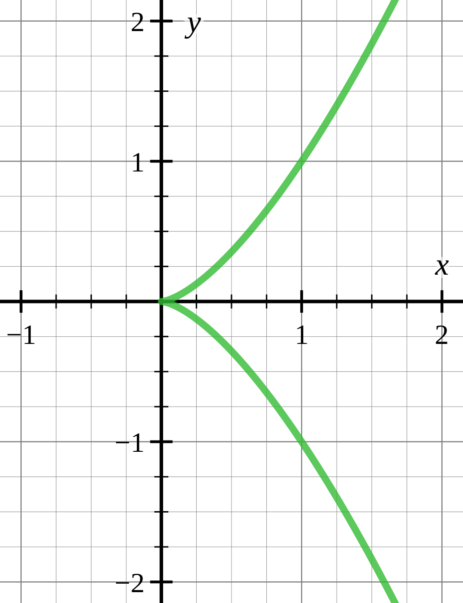
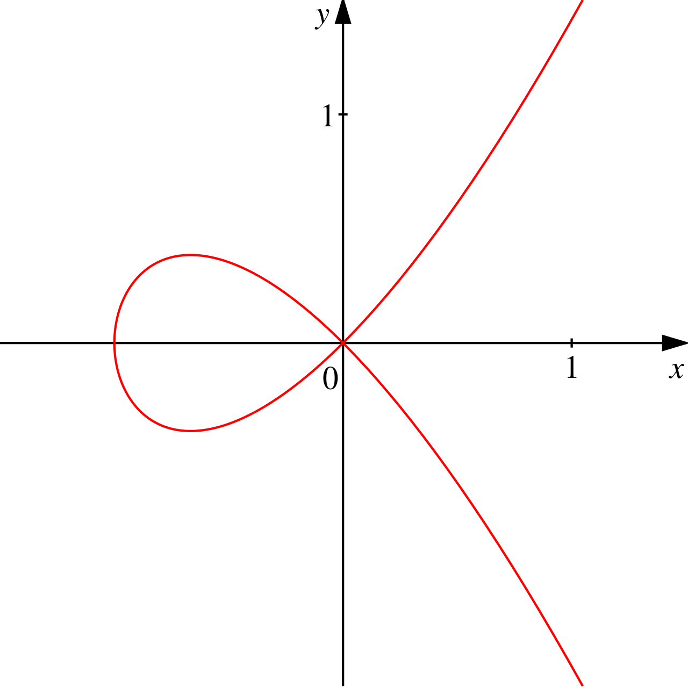

# 理解椭圆曲线密码

### 群

#### 定义
群$(G,\cdot)$是由非空集合$G$和二元运算$\cdot$构成的，且符合以下四个性质的数学结构。
1. 封闭性：对于所有$G$中的$a$，$b$，运算$a\cdot b$的结果也在$G$中；
2. 结合律：对于所有$G$中的$a$，$b$和$c$，等式$(a\cdot b)\cdot c = a\cdot (b \cdot c)$成立；
3. 单位元：存在$G$中的一个元素$e$，使得对于所有$G$中的元素$a$，总有等式$e \cdot a = a \cdot e = a$成立；
4. 逆元：对于每个$G$中的$a$，存在$G$中的一个元素$b$使得总有$a \cdot b = b \cdot a = e$，则称$b$为$a$在$G$中的逆元，$e$为单位元。
例如，整数集和整数间的加法$(\mathbb{Z},+)$构成一个群，单位元是$0$，一个整数的逆元是它的相反数。

#### 相关概念
- 若代数结构$(G,\cdot)$满足封闭性和结合律性质，则称$(G,\cdot)$为一个半群。
- 对于$G$中的所有$a$，$b$,等式$a\cdot b = b \cdot a$成立，则群$(G,\cdot)$为可交换群。
- 一个群可以有有限个元素，此时，元素的个数称为群的阶，记为$|G|$，也可以含有无限个元素。
- 给定群$G$，如果集合$H \subseteq G$，且$H$中包含了单位元，$H$中每个元素的逆元也在$H$中，则称$H$为$G$的子群。
- 给定群$(G,\cdot)$，求幂操作即对一个元素$a$应用$n$次运算符$cdot$，表示为
\begin{equation}
a^n = \underbrace{a\cdot a \cdot a \cdots a}_{n}
\end{equation}
特别的，$a^0=e$
- 循环群：是指能由群中的某个元素做幂运算而生成的群，例如整数加群$(\mathbb{Z},+)$是一个无限循环群，生成元为$1$或$-1$
- 拉格朗日定理：设$H$是有限群$G$的一个子群，则$H$的阶整除$G$的阶。
    - 推论1：若$a$是有限群$G$的一个元素，则$a$的阶整除$G$的阶。
    - 推论2：阶为质数的群都是循环群。
    - 推论3：费马小定理是拉格朗日定理的一个简单推论
### 环
环是由集合$R$和定义在$R$的加法和乘法两种二元运算构成的，且满足以下性质的代数结构$(R,+,\cdot)$：
1. $(R,+)$构成交换群，其单位元记为$0$，$R$中元素$a$的加法逆元记为$-a$；
2. $(R,\cdot)$构成半群；
3. 乘法对于加法满足分配律，即对所有的$a,b,c \in R$有：
- $a \cdot (b+c) = (a\cdot b)+(a\cdot c)$
- $(a+b)\cdot c = (a \cdot c) + (b \cdot c)$
#### 特殊的环
- 交换环：若环$(R,\cdot)$满足交换律，则$R$称为交换环
- 幺环：若环$R$存在乘法单位元$1$，则称$R$为幺环。
- 除环：若幺环$R$的所有非零元素存在乘法逆元$a^{-1}$，则称$R$为除环。
### 域
在抽象代数中，域是一种集合，在这个集合中可以对集合的非零元素进行加减乘除，其运算定义与行为就如同有理数和实数一样。域是交换除环。

### 椭圆函数
在数学上，椭圆曲线为一平面代数曲线，由如下形式的方程定义：
\begin{equation}
y^2=x^3+ax+b
\end{equation}
且满足其是无奇点的，即其图形没有尖点或自相交，代数上来说，这成立当且仅当判别式
\begin{equation}
\Delta = -16(4a^3+27b^2)
\end{equation}
不等于$0$。

- 尖点：曲线中的一种奇点。曲线上的动点在移到尖点时会开始反向移动
- 自相交：在数学上是指曲线和自身相交叉的点，曲线的二个分支在此位置有不同的切线。叉点也称为平常二重点



#### 椭圆曲线上的加法
任意取椭圆曲线上的两点$P$，$Q$（若$P$，$Q$两点重合，则做$P$点的切线）做直线交于椭圆曲线的另一点$R^{\prime}$，过$R^{\prime}$做$y$轴的平行线交于$R$，我们规定$P+Q=R$

- 根据椭圆曲线加法法则，可知椭圆曲线无穷远点与椭圆曲线上一点$P$的连线交于$P^{\prime}$，过$P^{\prime}$做$y$轴的平行线交于$P$，所以有$0+P=p$。我们把无穷远点称为零点，把$P^{\prime}$成为$P$的负元。
- 根据此法则，可知，如果椭圆曲线上的三个点$A$，$B$，$C$处于同一条直线上，那么他们的和等于零元。即$A+B+C=0$。

#### 密码学中的椭圆曲线
密码学中的椭圆曲线是定义在有限域上的。有限域是一个有有限个元素的集合，下面定义一个整数模$p$的集合$\mathbb{F}_p$，$p$是素数。

- $\mathbb{F}_p$中只有$p$个元素$0,1,2,3 \cdots p-2,p-1$;
- $\mathbb{F}_p$的加法法则是$a+b \equiv c \ (mod \ p)$；
- $\mathbb{F}_p$的加法法则是$a-b \equiv c \ (mod \ p)$，即$a+(-b) \equiv c \ (mod \ p)$；
- $\mathbb{F}_p$的乘法法则是$a \times b \equiv c \ (mod \ p)$；
- $\mathbb{F}_p$的除法法则是$a/b \equiv c \ (mod \ p)$，即$a \times b^{-1} \equiv c \ (mod \ p)$；
- $\mathbb{F}_p$的单位元是$1$，零元是$0$。

有限域上的椭圆函数可表示为：

\begin{equation}
\lbrace (x,y) \in (\mathbb{F})^2 | y^2=x^3+ax+b \ (mod \ p),4a^3+27b^2 \not\equiv 0 \ (mod \ p) \rbrace \cup \lbrace 0 \rbrace
\end{equation}

椭圆曲线上点的阶：如果椭圆曲线上一点$P$，存在最小的正整数$n$，使得$nP=P$，则称$n$为$P$的阶，在有限域上定义的椭圆曲线上的点的阶都是存在的

##### 椭圆曲线有限域上的加法法则
设$P,Q \in E_p(a,b)$，则
1. $P+0=P$
2. 如果$P=(x,y)$，那么$(x,y)+(x,-y)=0$，即$(x,-y)$是$P$的加法逆元，即$-P$；
3. 设$P=(x_1,y_1)$，$Q=(x_2,y_2)$，$P\neq -Q$，则$P+Q=(x_3,y_3)$由以下规则确定：
\begin{equation}
x_3 \equiv \lambda^2 -x_1-x_2 \ (mod \ p)
\end{equation}
\begin{equation}
y_3 \equiv \lambda (x_1-x_3) - y_1 \ (mod \ p)
\end{equation}
其中
\begin{equation}
\lambda =
\begin{cases}
\frac{y_2-y_1}{x_2-x_1},& P \neq Q  \\\
\frac{3x_1^2+a}{2y_1}, & P = Q
\end{cases}
\end{equation}

#### 椭圆曲线上的加解密

椭圆曲线加密的数学原理：椭圆曲线上的两个点$P$和$Q$，$k$为整数。
\begin{equation}
Q=kP
\end{equation}
点$P$称为基点，$k$为私有密钥，$Q$为公开密钥

- 给定$k$和$P$，根据加法法则，计算$Q$很容易
- 但给定$P$和$Q$，求$k$非常困难

现在描述利用椭圆曲线进行加密通信的过程
1. Alice选定一条椭圆曲线$E_p(a,b)$，并取椭圆曲线上一点，作为基点$G$；
2. Alice选择一个私钥$k$，并生成公钥$K=kG$；
3. ALice将$E_p(a,b)$和点$K$，$G$传给Bob；
4. Bob收到消息后，将要传输的信息编码到$E_p(a,b)$上一点$M$，并产生一个随机整数$r$,$(r<n)$；
5. Bob计算点$C_1=M+rK$，$C_2=rG$；
6. Bob将$C_1$，$C_2$传给Alice；
7. Alice收到消息后，计算$C_1-kC_2$，结果就是$M$。

密码学中，描述一条$\mathbb{F}_p$上的椭圆曲线，会用到六个参量

\begin{equation}
T=(p,a,b,G,n,h)
\end{equation}

$p,a,b$用来确定一条椭圆曲线，$G$为基点，$n$为点$G$的阶，$h$是椭圆曲线上所有点的个数$m$模$n$的值。
以上参量值一般要求满足以下几个条件
- $p$越大越安全，但越大计算速度越慢，200位左右即可；
- $pt \neq 1 \ (mod \ n),\ 1 \le t < 20$；
- $4a^3+27b^2 \neq 0 \ (mod \ p)$；
- $n$为素数；
- $h \le 4$。

### 参考文献
- [1] [[区块链] 密码学——椭圆曲线密码算法（ECC）](https://www.cnblogs.com/X-knight/p/9153209.html)
- [2] [群](https://zh.m.wikipedia.org/zh-cn/%E7%BE%A4)
- [3] [环](https://zh.m.wikipedia.org/wiki/%E7%8E%AF_(%E4%BB%A3%E6%95%B0))
- [4] [域](https://zh.m.wikipedia.org/zh-cn/%E5%9F%9F_(%E6%95%B0%E5%AD%A6))
- [5] [椭圆曲线](https://zh.m.wikipedia.org/zh-cn/%E6%A4%AD%E5%9C%86%E6%9B%B2%E7%BA%BF)
- [6] [ECC椭圆曲线加密算法：有限域和离散对数](https://zhuanlan.zhihu.com/p/44743146)
