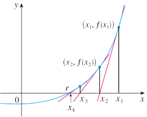

# 牛顿迭代法


牛顿法是一种在实数域和复数域上近似求解方程的方法，最初由牛顿在《流数法》中提出，此方法使用函数$f(x)$的泰勒级数的前面几项来寻找方程$f(x)=0$的根。

### 方法说明

首先，选择一个接近函数$f(x)$零点的$x_0$，计算相应的$f(x_0)$和切线斜率$f^{\prime}(x_0)$。然后计算穿过点$(x_0,f(x_0))$并且斜率为$f^{\prime}(x_0)$的直线与$x$州的交点的坐标，即求下面方程的解：
\begin{equation}
0=(x-x_0)\cdot f^{\prime}(x_0)+f(x_0)
\end{equation}

将新求得的点的$x$坐标命名为$x_1$,通常$x_1$会比$x_0$更接近方程$f(x)=0$的解。因此可以利用$x_1$开始下一轮迭代。迭代公式可化简为如下所示：
\begin{equation}
x_{n+1}=x_n-\frac{f(x_n)}{f^{\prime}(x_n)}
\end{equation}

随着迭代次数的增加，$x_n$会越来越接近方程的解。
<div align=center></div>

### 示例

#### 求解平方根
设$f(x)=x^2-n$，$f(x)=0$的解就是$\sqrt{n}$的近似值，于是有
\begin{equation}
x_{i+1}=x_i-\frac{x^2_i-n}{2x_i}=\frac{x_i+\frac{n}{x_i}}{2}
\end{equation}

代码如下

```C++
double sqrt_newton(double n) {
    const double eps = 1e-15;
    double x = 1;
    while(true){
        double nx = ( x + n / x ) / 2;
        if(abs(x  -nx) < eps)
            break;
        x = nx;
    }
    return x;
}
```


